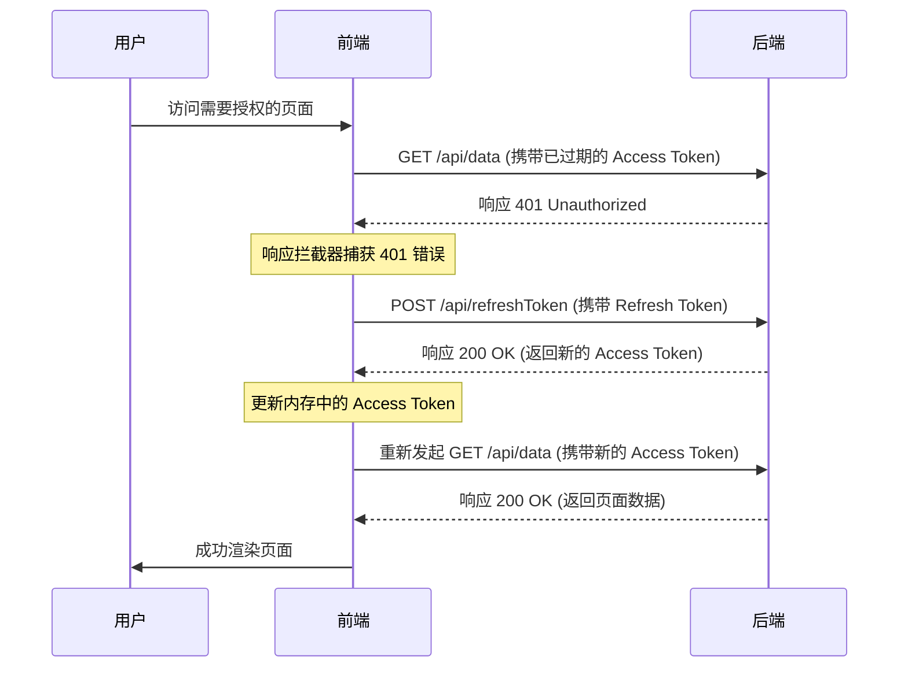

前端如何使用 `Access Token` 和 `Refresh Token`

### 核心理念

这个双令牌机制的核心是为了在 **安全** 和 **用户体验** 之间找到一个完美的平衡点：

1.  **Access Token (访问令牌)**：
    *   **用途**：作为用户身份的凭证，附加在每个需要授权的 API 请求中。
    *   **特点**：**生命周期短**（例如 15 分钟到 4 小时）。即使被窃取，攻击者也只能在很短的时间内滥用它，从而降低了安全风险。

2.  **Refresh Token (刷新令牌)**：
    *   **用途**：专门用来获取一个新的、有效的 `Access Token`。它本身不能用来访问 API。
    *   **特点**：**生命周期长**（例如 7 天到 30 天）。它使得用户在 `Access Token` 过期后，无需重新输入用户名和密码就能“无感”地刷新会话，保持登录状态，极大地提升了用户体验。

---

### 标准的前端处理流程

下面是前端处理这两个令牌的完整生命周期，这也是目前行业的标准实践。

#### 1. 用户登录

1.  **提交凭证**：用户在登录页面输入用户名和密码。
2.  **发送请求**：前端将这些凭证发送到后端的 `/login` 接口。
3.  **获取令牌**：后端验证成功后，生成 `Access Token` 和 `Refresh Token`，并将它们一起返回给前端。

   ```json
   // 后端成功登录后的响应
   {
     "code": 1000,
     "message": "success",
     "data": {
       "accessToken": "eyJhbGciOiJIUzI1NiIsInR5cCI6IkpXVCJ9...",
       "refreshToken": "def50200f21e7c6..."
     }
   }
   ```

#### 2. 存储令牌（关键步骤）

前端拿到这两个令牌后，需要将它们安全地存储起来。存储位置有几种选择，各有优劣：

*   **`localStorage` / `sessionStorage`**：
    *   **优点**：使用简单，跨页面标签页（仅 `localStorage`）也能共享。
    *   **缺点**：**不安全**。容易受到 XSS (跨站脚本) 攻击。任何在页面上运行的第三方 JS 脚本都可以读取到它们，一旦 `Refresh Token` 被盗，后果严重。
*   **内存变量 (例如 Redux/Pinia/Zustand 等状态管理库)**：
    *   **优点**：比 `localStorage` 安全，因为 JS 无法直接跨域访问。
    *   **缺点**：页面一旦刷新，数据就会丢失，用户需要重新登录。
*   **`HttpOnly` Cookie**：
    *   **优点**：**最安全的方式**。通过设置 `HttpOnly` 属性，JavaScript 将无法读取到 Cookie 内容，可以有效防止 XSS 攻击。浏览器会自动在每次请求时携带它。
    *   **缺点**：需要后端配合设置。同时，如果前后端分离且跨域，处理起来会稍微复杂一些，并且容易受到 CSRF (跨站请求伪造) 攻击，需要后端配合设置 `SameSite` 属性并部署 CSRF 令牌。

**最佳实践推荐**：

*   将 **`Refresh Token`** 存储在 **`HttpOnly` Cookie** 中。这是最敏感的令牌，必须得到最高级别的保护。
*   将 **`Access Token`** 存储在 **内存** 中（例如，状态管理库的变量）。这样既保证了基本的安全（刷新页面会丢失，但 XSS 无法轻易获取），又能方便地附加到 API 请求头中。

#### 3. 发起已认证的 API 请求

当需要请求受保护的资源时（例如获取用户信息、提交表单等）：

1.  前端从内存中读取 `Access Token`。
2.  将其放入 HTTP 请求的 `Authorization` 头中。

   ```javascript
   // 使用 axios 发起请求的例子
   axios.get('/api/user/profile', {
     headers: {
       'Authorization': `Bearer ${accessToken}` // accessToken 从内存中获取
     }
   });
   ```

3.  后端收到请求，验证 `Authorization` 头中的 `Access Token`。如果有效，则返回数据。

#### 4. 处理 Access Token 过期（核心逻辑）

这是整个流程中最关键的部分，通常通过 **HTTP 请求拦截器** (Interceptor) 来实现自动化处理。

1.  前端使用一个**已过期**的 `Access Token` 发起请求。
2.  后端验证后发现令牌已过期，返回 `401 Unauthorized` 状态码。
3.  前端的 **HTTP 响应拦截器** 捕获到这个 `401` 错误。
4.  拦截器**暂停**当前失败的请求，并自动执行以下操作：
    a.  向后端的 `/refreshToken` 接口发起请求。这个请求会携带 `HttpOnly` Cookie 中的 `Refresh Token`。
    b.  后端验证 `Refresh Token`。
    c.  如果 `Refresh Token` 有效，后端返回一个**新的 `Access Token`**。
5.  拦截器收到新的 `Access Token` 后：
    a.  更新内存中存储的 `Access Token`。
    b.  使用这个**新的 `Access Token`** 重新发起刚才失败的那个请求。
6.  后端接收到重发的请求，验证新的 `Access Token` 通过，返回正常数据。

整个过程对用户来说是**完全无感**的，他们不会看到任何错误，只会感觉请求稍微慢了一点。

#### 5. 处理 Refresh Token 过期

如果在第 4 步中，刷新 `Access Token` 的请求也失败了（通常是因为 `Refresh Token` 本身也过期了或被后端作废了），那么：

1.  拦截器捕获到刷新令牌失败的错误。
2.  此时，用户的会话已彻底结束，无法再自动续期。
3.  前端应该：
    a.  清除所有存储的用户信息和令牌。
    b.  强制将页面重定向到登录页。
    c.  提示用户“会话已过期，请重新登录”。

#### 6. 用户登出

1.  用户点击“登出”按钮。
2.  前端应主动调用后端的 `/logout` 接口。
3.  后端接收到请求后，应将当前用户的 `Refresh Token` **加入黑名单或从数据库中删除**，使其立即失效。
4.  无论后端是否成功，前端都必须**清除本地存储的所有令牌和用户信息**，并重定向到登录页。

---

### 流程图

下面是一个简化的序列图，清晰地展示了“无感刷新”的过程。



希望这个详细的解释能帮助你完全理解前端如何处理 `Access Token` 和 `Refresh Token`！