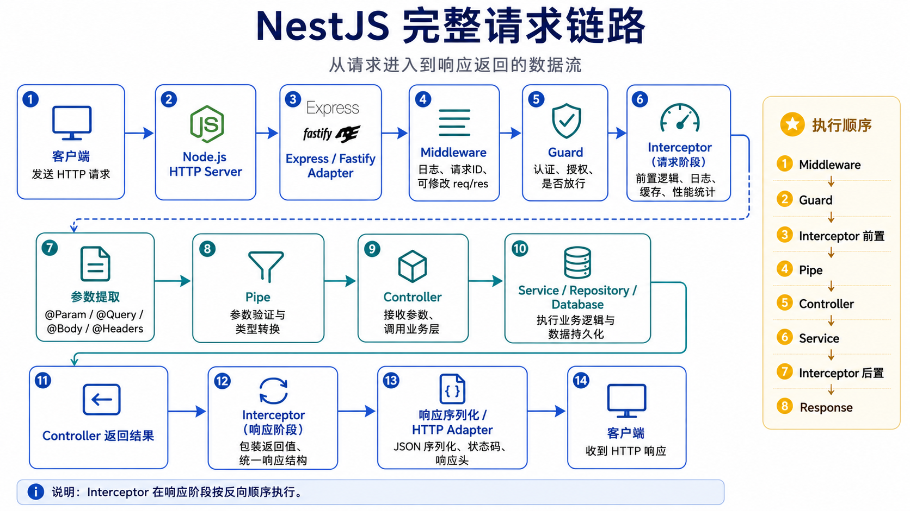
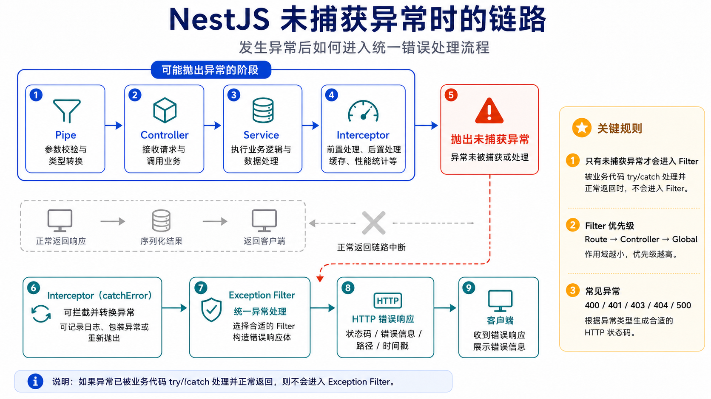

## NestJS 是什么

NestJS 是一个基于 **Node.js + TypeScript** 的服务端开发框架，主要用来构建：

* REST API
* GraphQL 服务
* WebSocket 服务
* 微服务
* 后台管理系统
* 企业级后端应用

它默认运行在 **Express** 之上，也可以切换为 **Fastify**。

NestJS 最大的特点是：它不像 Express 那样只提供基础路由能力，而是提供了一套完整的后端工程架构，包括依赖注入、模块划分、权限校验、参数验证、异常处理、日志、缓存、数据库集成等。

可以简单理解为：

> NestJS = TypeScript + Express/Fastify + 依赖注入 + 模块化架构 + 完整的后端工程规范

## 关键词
Middleware  
Guard  
Interceptor：请求阶段 前置逻辑  
Pipe  
Controller  
Service / Repository / Database  
Controller 返回结果  
Interceptor：响应阶段 后置逻辑  
响应序列化 + HTTP Adapter  
Exception Filter 发生未捕获异常时或主动抛出异常时调用  

## 请求链路

## 未捕获异常的链路
