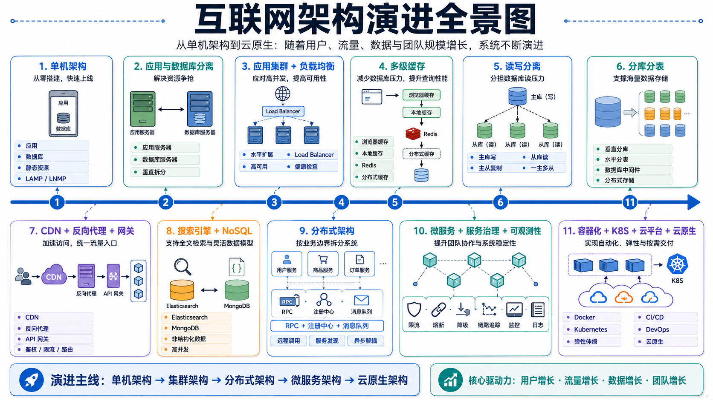

# 从单机到云原生：互联网架构是如何一步步演变的？

互联网架构并不是一开始就设计成今天这样复杂。

负载均衡、缓存、消息队列、分库分表、微服务、容器、Kubernetes……这些技术的出现，并不是为了追求所谓的“高大上”，而是因为原有架构遇到了实际问题。

随着用户数量、访问流量、数据规模和团队人数不断增长，系统会持续暴露出新的瓶颈。为了解决这些瓶颈，架构也会从单机逐渐演变为集群、分布式、微服务，最终进入云原生阶段。

整个演进过程可以概括为：

> 单机架构 → 应用与数据库分离 → 应用集群 → 缓存与读写分离 → 分库分表 → 分布式架构 → 微服务 → 容器化 → 云平台 → 云原生



下面通过一个网站不断成长的过程，理解互联网架构为什么会一步步演变成今天的样子。

---

## 一、单机架构：一个服务器承载所有功能

故事的起点很简单。

你开发了一个网站，刚上线时用户量很少，访问量也不高。为了快速交付，没有必要设计复杂的分布式系统，只需要准备一台服务器，在上面部署：

* Web 服务器；
* 应用程序；
* 数据库；
* 静态资源。

使用一套常见的 LAMP 或 LNMP 技术栈，就可以快速完成系统搭建。

例如：

```text
用户
  │
  ▼
单台服务器
├── Nginx / Apache
├── PHP / Java / Node.js 应用
├── MySQL
└── 静态资源
```

其中：

* LAMP：Linux、Apache、MySQL、PHP；
* LNMP：Linux、Nginx、MySQL、PHP。

单机架构的优点非常明显：

* 部署简单；
* 开发成本低；
* 运维方便；
* 适合业务验证和早期产品。

但随着用户数量增长，问题也开始出现。

应用程序需要消耗 CPU 和内存，数据库则会产生大量磁盘 I/O。它们运行在同一台服务器上，会互相争抢资源。

当应用查询变慢、数据库响应变慢时，单机架构就逐渐到达瓶颈。

---

## 二、应用与数据库分离：解决资源争抢

为了避免应用和数据库互相影响，最直接的办法就是增加服务器。

将应用程序部署在一台服务器上，将数据库部署在另一台服务器上：

```text
用户
  │
  ▼
应用服务器
  │
  ▼
数据库服务器
```

这样一来：

* 应用服务器专门处理用户请求和业务逻辑；
* 数据库服务器专门负责数据存储和查询；
* CPU、内存和磁盘资源不再互相争抢；
* 应用和数据库可以分别升级配置。

这一阶段也可以看作最简单的垂直拆分。

所谓垂直拆分，就是将不同职责的组件部署到不同服务器上。

不过，这种架构仍然存在单点问题：如果应用服务器发生故障，整个网站依然无法访问。

与此同时，随着访问量继续增长，单台应用服务器也会逐渐处理不过来。

---

## 三、应用集群：通过水平扩展提高处理能力

假设一台应用服务器每秒最多处理 1000 个请求，但业务高峰期每秒会产生 5000 个请求。

继续升级单台服务器配置，属于垂直扩展：

* 增加 CPU；
* 增加内存；
* 使用更快的磁盘；
* 更换性能更高的服务器。

但单台服务器的性能终究存在上限，而且高配置服务器通常价格昂贵。

另一种思路是部署多台配置相近的应用服务器，让它们运行相同的程序，共同处理请求：

```text
              ┌── 应用服务器 1
用户请求 ──────┼── 应用服务器 2
              ├── 应用服务器 3
              └── 应用服务器 4
```

这种方式称为水平扩展。

当流量增加时，继续增加应用服务器；流量下降时，可以减少服务器数量。

但是新的问题随之出现：

> 用户请求应该发送到哪一台应用服务器？

---

## 四、负载均衡：将请求分配给应用集群

为了把请求合理地分发到不同应用服务器，需要在用户和应用集群之间增加一个流量调度层，这就是负载均衡器。

```text
                    ┌── 应用服务器 1
用户 ──▶ 负载均衡器 ├── 应用服务器 2
                    ├── 应用服务器 3
                    └── 应用服务器 4
```

负载均衡器可以使用多种算法分配请求，例如：

* 轮询；
* 加权轮询；
* 最少连接；
* IP 哈希；
* 一致性哈希；
* 根据服务器响应时间动态调度。

常见的负载均衡实现包括：

* Nginx；
* HAProxy；
* LVS；
* 云厂商提供的负载均衡服务。

负载均衡不仅负责分发请求，还可以对后端服务器进行健康检查。

当某台应用服务器出现故障时，负载均衡器可以暂时停止向它转发流量，由其他正常服务器继续处理请求，从而提升系统可用性。

到这里，应用层已经具备了基本的水平扩展和高可用能力。

但是随着应用服务器数量增加，大量请求会同时访问数据库，数据库很快成为新的性能瓶颈。

---

## 五、多级缓存：减少数据库访问压力

很多业务数据不会频繁变化，却会被反复查询。

例如：

* 商品详情；
* 用户信息；
* 网站配置；
* 热门文章；
* 首页推荐；
* 商品分类。

如果每次请求都查询数据库，会造成大量重复计算和磁盘 I/O。

因此，可以在应用和数据库之间增加缓存层。

```text
用户
  │
  ▼
应用集群
  │
  ├── 缓存命中 ──▶ 直接返回
  │
  └── 缓存未命中 ──▶ 查询数据库
                         │
                         └── 写入缓存
```

常见的分布式缓存包括：

* Redis；
* Memcached。

一个成熟系统通常不只有一层缓存，而是采用多级缓存：

### 1. 浏览器缓存

通过 HTTP 响应头缓存图片、CSS、JavaScript 等静态资源，减少重复下载。

### 2. CDN 缓存

将静态资源缓存在距离用户更近的边缘节点。

### 3. 反向代理缓存

由 Nginx、Varnish 等组件缓存部分页面或接口响应。

### 4. 应用本地缓存

将少量高频数据缓存在应用进程内，例如使用 Caffeine。

本地缓存速度很快，但不同应用实例之间的数据可能不一致。

### 5. 分布式缓存

多个应用实例共同访问 Redis 等缓存服务，可以实现缓存共享。

缓存可以显著降低数据库压力，但也会引入新的问题：

* 缓存穿透；
* 缓存击穿；
* 缓存雪崩；
* 缓存与数据库一致性；
* 热点 Key；
* 大 Key。

因此，缓存并不是简单地“加一个 Redis”就结束了，而是需要结合业务场景设计更新和失效策略。

---

## 六、数据库读写分离：分担查询压力

缓存能够解决一部分热点查询，但写请求、非热点查询和缓存未命中的请求仍然需要访问数据库。

在大多数互联网业务中，数据库通常具有读多写少的特点。

例如，一个商品信息可能只修改几次，却会被查询数万次。

因此，可以通过主从复制搭建数据库集群：

* 主库负责写入；
* 从库负责查询；
* 主库将数据变更同步到从库。

```text
                  ┌── 从库 1：查询
应用 ──▶ 数据库代理 ├── 从库 2：查询
                  └── 主库：写入
                         │
                         └── 数据同步到从库
```

这种模式称为读写分离。

当查询压力继续增加时，可以增加更多从库：

```text
一主多从
```

需要注意的是，主从复制通常存在一定延迟，并不一定能够做到完全实时。

因此，系统可能遇到这样的情况：

1. 用户刚刚修改了数据；
2. 写请求已经提交到主库；
3. 从库还没有完成同步；
4. 用户立即查询时，读取到了旧数据。

这种问题通常称为主从延迟或读后不一致。

对于一致性要求较高的场景，可以采取以下策略：

* 写入后的一段时间内强制读取主库；
* 对关键业务直接读取主库；
* 使用半同步复制；
* 在业务层进行数据版本校验；
* 根据一致性要求选择不同的数据存储方案。

读写分离提高了数据库的读能力，但它并没有解决单表数据量过大的问题。

---

## 七、分库分表：应对海量数据

随着业务运行时间越来越长，数据库中的数据量会持续增加。

例如：

* 用户表达到数千万行；
* 订单表达到数亿行；
* 日志表达到数十亿行；
* 单个数据库实例容量不断膨胀；
* 索引越来越大；
* 查询、写入和备份都越来越慢。

这时，单库单表已经难以支撑业务，需要进一步拆分。

### 1. 垂直分库

按照业务领域拆分数据库：

```text
用户库
商品库
订单库
支付库
库存库
```

不同业务拥有独立数据库，可以减少业务之间的相互影响。

例如订单查询量暴涨时，不会直接占用用户库的数据库连接。

### 2. 垂直分表

将一张字段很多的大表，按照字段用途拆分成多张表。

例如将用户表拆分为：

* 用户基础信息表；
* 用户登录信息表；
* 用户扩展资料表；
* 用户安全设置表。

这样可以减少单行数据大小，提高高频字段的查询效率。

### 3. 水平分库

将同一种业务数据按照规则分散到多个数据库中。

例如根据用户 ID 进行取模：

```text
user_id % 4
```

将用户数据分散到 4 个数据库中。

### 4. 水平分表

将一张大表拆成多张结构相同的小表。

例如：

```text
order_00
order_01
order_02
...
order_63
```

应用可以根据用户 ID、订单 ID 或其他分片键，计算数据位于哪一张表中。

为了降低应用直接管理分片规则的复杂度，通常会使用数据库中间件，例如：

* Apache ShardingSphere；
* MyCat；
* Vitess；
* 云厂商提供的分布式数据库服务。

分库分表能够提升存储容量和并发能力，但也会引入许多新的问题：

* 跨库事务；
* 跨库 Join；
* 分页查询；
* 数据聚合；
* 全局唯一 ID；
* 数据迁移；
* 分片扩容；
* 分布式事务。

因此，分库分表通常应该在单库真正达到瓶颈后再使用，而不是系统刚上线就提前设计几十个分片。

---

## 八、CDN：让用户就近访问静态资源

随着业务覆盖范围扩大，用户可能分布在不同城市，甚至不同国家和地区。

即使源站性能很好，距离较远的用户仍然可能遇到：

* 网络延迟高；
* 图片加载慢；
* 视频频繁缓冲；
* 跨运营商访问不稳定；
* 源站出口带宽压力大。

这时可以接入 CDN，也就是内容分发网络。

CDN 会将静态资源缓存到分布在不同地区的边缘节点中。

```text
用户
  │
  ▼
附近的 CDN 节点
  │
  ├── 已缓存：直接返回
  │
  └── 未缓存：回源获取
                    │
                    ▼
                  源站
```

适合通过 CDN 分发的内容包括：

* 图片；
* CSS；
* JavaScript；
* 字体；
* 安装包；
* 音频；
* 视频；
* 可缓存的接口响应。

CDN 的主要价值包括：

* 缩短用户与资源之间的网络距离；
* 降低访问延迟；
* 减少源站带宽消耗；
* 缓解源站访问压力；
* 提升静态资源可用性。

CDN 解决的是内容分发问题，而应用服务器本身仍然不应该直接暴露在公网中。

---

## 九、反向代理与 API 网关：统一流量入口

为了隐藏后端应用服务器，并统一管理外部请求，通常会在应用集群前增加反向代理。

```text
用户
  │
  ▼
反向代理
  │
  ▼
负载均衡
  │
  ▼
应用集群
```

反向代理可以提供：

* 请求转发；
* TLS 终止；
* 域名管理；
* 负载均衡；
* 静态资源服务；
* 响应压缩；
* 请求缓存；
* 访问日志；
* 隐藏后端服务器地址。

常见的反向代理包括：

* Nginx；
* HAProxy；
* Envoy；
* Traefik。

需要注意的是，反向代理本身并不等于专业的安全防护系统。

它可以隐藏后端地址、限制部分请求，但要实现完整的 DDoS 防护、Web 攻击检测和流量清洗，通常还需要结合：

* CDN；
* WAF；
* DDoS 高防服务；
* 防火墙；
* 安全网关。

随着系统接口越来越多，普通反向代理的功能可能无法满足业务需求，于是出现了 API 网关。

API 网关可以理解为面向 API 场景的增强型流量入口，通常还会提供：

* 身份认证；
* 权限校验；
* 动态路由；
* 接口限流；
* 熔断降级；
* 协议转换；
* 灰度发布；
* 请求聚合；
* 日志审计；
* API 版本管理。

常见的 API 网关包括：

* Spring Cloud Gateway；
* Kong；
* Apache APISIX；
* Envoy Gateway；
* 云厂商 API 网关。

反向代理更偏向通用流量转发，API 网关则更偏向接口管理和服务治理。

---

## 十、搜索引擎与 NoSQL：解决特殊数据场景

随着业务复杂度增加，关系型数据库不再适合处理所有数据需求。

### 1. 搜索引擎

假设一个电商平台需要支持：

* 商品名称搜索；
* 商品描述搜索；
* 模糊匹配；
* 搜索关键词高亮；
* 相关度排序；
* 多条件筛选；
* 搜索建议；
* 聚合统计。

如果直接使用 MySQL 的 `LIKE '%关键词%'`，当数据量增大后，查询性能会迅速下降。

搜索引擎通过倒排索引等数据结构，可以更高效地完成全文检索。

常见的搜索引擎包括：

* Elasticsearch；
* OpenSearch；
* Solr。

它们适合处理：

* 商品搜索；
* 文章搜索；
* 日志检索；
* 全文检索；
* 多维聚合分析。

### 2. NoSQL 数据库

部分业务数据结构变化频繁，或者需要极高的并发读写能力，并不适合完全存储在传统关系型数据库中。

因此，可以根据数据模型引入不同类型的 NoSQL 数据库。

例如：

* MongoDB：文档数据库；
* Redis：键值数据库；
* Cassandra：宽列数据库；
* HBase：分布式列式数据库；
* Neo4j：图数据库。

NoSQL 并不是关系型数据库的替代品，而是补充。

一个大型系统往往会根据不同场景组合使用多种存储：

```text
MySQL        保存核心交易数据
Redis        保存缓存和临时状态
Elasticsearch 提供全文搜索
MongoDB      保存结构灵活的文档
对象存储      保存图片、视频和文件
```

这种架构也被称为多模型存储或多语言持久化。

---

## 十一、分布式架构：按照业务边界拆分系统

随着业务越来越复杂，所有功能都放在同一个应用中，会逐渐形成巨石应用。

例如，一个应用同时包含：

* 用户管理；
* 商品管理；
* 订单管理；
* 库存管理；
* 支付管理；
* 营销活动；
* 售后服务；
* 内容管理。

巨石应用在早期开发效率很高，但规模扩大后会出现很多问题：

* 代码仓库越来越庞大；
* 模块之间耦合严重；
* 多人开发容易产生冲突；
* 修改一个小功能也要发布整个应用；
* 某个模块流量升高时，只能整体扩容；
* 一个模块故障可能影响整个系统；
* 构建、测试和发布时间越来越长。

为了解决这些问题，可以按照业务边界将系统拆分为多个独立应用：

```text
用户系统
商品系统
订单系统
库存系统
支付系统
营销系统
```

每个系统可以：

* 独立开发；
* 独立部署；
* 独立扩容；
* 独立维护；
* 使用独立数据库；
* 由不同团队负责。

这就是分布式架构的重要特征：系统的不同组成部分运行在多台服务器上，通过网络进行协作。

不过，应用拆分后，原来在同一个进程内完成的方法调用，现在变成了跨网络调用。

---

## 十二、RPC：让服务之间完成远程调用

在单体应用中，订单模块调用库存模块，可能只是一次普通的方法调用。

```java
inventoryService.deduct(productId, quantity);
```

应用拆分后，订单服务和库存服务运行在不同服务器上，它们只能通过网络通信。

例如，创建订单时可能需要：

1. 查询商品信息；
2. 检查库存；
3. 锁定库存；
4. 创建订单；
5. 发起支付。

为了降低远程调用的复杂度，可以使用 RPC，也就是远程过程调用。

RPC 的目标是：

> 让开发者调用远程服务时，尽可能接近调用本地方法的体验。

常见的 RPC 框架和协议包括：

* Dubbo；
* gRPC；
* Apache Thrift；
* Motan；
* brpc。

服务之间也可以通过 HTTP REST API 通信。

两者没有绝对优劣：

* HTTP API 通用性更强，适合跨语言和外部系统调用；
* RPC 通常性能更高，接口约束更强，适合内部服务调用。

但是服务数量增加后，调用方不能一直手动配置每个服务实例的 IP 地址。

服务可能随时扩容、缩容、重启或迁移，因此需要一种动态发现服务地址的机制。

---

## 十三、服务注册与发现：动态管理服务实例

假设库存服务有多个实例：

```text
10.0.1.11:8080
10.0.1.12:8080
10.0.1.13:8080
```

如果订单服务把这些地址直接写在配置文件中，那么每次库存服务扩容、缩容或迁移，都需要修改配置并重新发布订单服务。

为了解决这个问题，可以引入服务注册与发现中心。

```text
库存服务 ──注册──▶ 注册中心
订单服务 ──查询──▶ 注册中心
订单服务 ──调用──▶ 库存服务
```

服务启动时，将自己的地址注册到注册中心；调用方需要访问服务时，从注册中心查询可用实例。

注册中心还可以通过健康检查，及时移除不可用实例。

常见的服务注册与发现组件包括：

* Nacos；
* Eureka；
* Consul；
* ZooKeeper；
* etcd。

其中，Nacos 除了服务注册与发现，还可以提供配置管理能力。

注册中心解决了“服务在哪里”的问题，但没有解决“服务之间互相等待”的问题。

---

## 十四、消息队列：实现异步、解耦与削峰

在同步调用模式下，服务之间会层层等待。

例如用户提交订单后，系统可能同步执行：

1. 创建订单；
2. 扣减库存；
3. 增加积分；
4. 发送短信；
5. 发送邮件；
6. 更新统计数据；
7. 通知推荐系统。

如果所有步骤都必须同步完成，任何一个非核心服务响应变慢，都会增加整个请求的响应时间。

因此，可以引入消息队列：

```text
订单服务
  │
  ├── 创建订单
  │
  └── 发送“订单已创建”消息
              │
              ▼
           消息队列
         ┌────┼────┐
         ▼    ▼    ▼
      积分服务 短信服务 统计服务
```

订单服务只需要将消息写入消息队列，不必等待所有下游服务处理完成。

消息队列主要解决三个问题。

### 1. 异步

将不需要立即完成的操作放到后台处理，缩短接口响应时间。

### 2. 解耦

生产者不需要知道具体有哪些消费者，新增消费者时通常不需要修改生产者。

### 3. 削峰

在流量高峰期，消息先进入队列，消费者按照自身处理能力逐步消费，避免瞬时流量直接压垮后端系统。

常见的消息队列包括：

* RabbitMQ；
* RocketMQ；
* Kafka；
* Pulsar。

引入消息队列后，也会产生新的复杂问题：

* 消息丢失；
* 重复消费；
* 消息积压；
* 消费顺序；
* 延迟消息；
* 死信队列；
* 消息幂等；
* 最终一致性。

因此，消息队列不是为了替代所有同步调用。

需要立即返回结果的业务，仍然适合使用同步 RPC 或 HTTP；允许稍后完成的业务，才适合使用异步消息。

---

## 十五、微服务架构：将业务拆分为更小的自治单元

分布式架构运行一段时间后，部分业务系统仍然可能非常庞大。

例如用户系统内部可能包含：

* 用户注册；
* 用户登录；
* 用户资料；
* 用户权限；
* 用户积分；
* 用户等级；
* 用户会员；
* 用户安全。

于是，可以继续按照业务能力将应用拆分成更小的服务。

这就是微服务架构。

一个微服务通常具备以下特征：

* 围绕单一业务能力构建；
* 可以独立开发和部署；
* 可以独立扩容；
* 拥有清晰的接口边界；
* 可以由独立团队维护；
* 可以根据场景选择技术栈；
* 原则上管理自己的数据。

微服务并不是简单地“把代码拆得更细”。

真正的难点在于如何确定服务边界。如果拆分过粗，无法获得独立扩容和团队自治的好处；如果拆分过细，服务调用、数据一致性和运维成本会急剧上升。

微服务架构适合业务复杂、团队规模较大、服务需要独立迭代的系统。

对于小型项目或早期创业项目，结构清晰的模块化单体通常比微服务更加合适。

---

## 十六、服务治理：防止分布式系统发生雪崩

微服务数量增加后，一次用户请求可能经过多个服务：

```text
用户
  │
  ▼
API 网关
  │
  ▼
订单服务
  ├──▶ 用户服务
  ├──▶ 商品服务
  ├──▶ 库存服务
  ├──▶ 优惠服务
  └──▶ 支付服务
```

调用链越长，发生故障的概率就越高。

假设库存服务响应变慢，订单服务中的请求会持续等待，占用线程和连接。订单服务资源被耗尽后，网关也可能出现请求堆积，最终导致整个系统雪崩。

为了提升系统稳定性，需要引入服务治理机制。

### 限流

限制单位时间内进入系统的请求数量，防止突发流量压垮服务。

### 超时

远程调用超过指定时间后立即终止，避免请求无限等待。

### 重试

对于短暂的网络错误，可以进行有限次数的重试。

重试必须谨慎使用，否则可能进一步放大流量。

### 熔断

当某个下游服务持续失败时，暂时停止调用它，避免资源被无效请求耗尽。

### 降级

当系统压力过大或部分服务不可用时，暂时关闭非核心功能，优先保障核心业务。

### 隔离

为不同服务、接口或请求分配独立资源，避免一个模块耗尽全部线程或连接。

### 负载均衡

在多个服务实例之间合理分配请求。

常见的服务治理组件包括：

* Sentinel；
* Resilience4j；
* Envoy；
* Istio；
* Spring Cloud 相关组件。

这些机制相当于为分布式系统安装保险丝，防止局部故障扩散为全局故障。

---

## 十七、可观测性：快速定位复杂系统中的问题

单体应用发生故障时，查看一台服务器的日志可能就能找到原因。

微服务系统中，一次请求可能经过十几个甚至几十个服务。只查看单个服务日志，很难还原完整过程。

因此，需要建立可观测性体系。

可观测性通常包含三个核心部分：

### 1. 日志

记录系统运行事件和业务信息。

常见方案包括：

* ELK；
* EFK；
* Loki。

### 2. 指标

记录 CPU、内存、请求量、错误率、响应时间等数据。

常见方案包括：

* Prometheus；
* Grafana；
* VictoriaMetrics。

### 3. 链路追踪

为每个请求分配唯一的 Trace ID，记录请求经过的所有服务和处理时间。

常见方案包括：

* OpenTelemetry；
* Jaeger；
* Zipkin；
* SkyWalking。

例如，一次请求的调用链可能是：

```text
API 网关       20ms
  └─ 订单服务   180ms
      ├─ 用户服务    15ms
      ├─ 商品服务    25ms
      └─ 库存服务   120ms
```

通过链路追踪，可以快速发现库存服务是主要耗时节点。

全链路追踪的范围还可以进一步扩展，包括：

* 浏览器或移动端；
* CDN；
* API 网关；
* 后端服务；
* 消息队列；
* 缓存；
* 数据库；
* 第三方接口。

现代可观测性体系通常会结合日志、指标和链路数据，对系统进行统一分析。

---

## 十八、容器化：统一应用运行环境

微服务数量达到几十个甚至几百个以后，部署和运维会变得非常复杂。

不同服务可能依赖：

* 不同的操作系统环境；
* 不同版本的运行时；
* 不同的系统库；
* 不同的配置文件；
* 不同的启动方式。

开发环境可以运行，不代表测试和生产环境也能运行。

为了解决环境不一致问题，可以使用 Docker 将应用及其依赖打包为容器镜像。

```text
应用代码
运行时
系统依赖
启动命令
配置约定
    │
    ▼
容器镜像
```

容器化带来的主要价值包括：

* 构建一次，到处运行；
* 环境一致；
* 启动速度快；
* 资源隔离；
* 便于版本管理；
* 便于快速回滚；
* 提高资源利用率。

但容器数量增加后，手动管理仍然不现实。

运维人员需要面对：

* 容器应该运行在哪台机器；
* 服务需要启动多少副本；
* 容器故障后如何恢复；
* 新版本如何滚动发布；
* 流量增加后如何扩容；
* 配置和密钥如何管理；
* 服务之间如何通信。

于是，容器编排平台出现了。

---

## 十九、Kubernetes：自动管理大规模容器

Kubernetes，简称 K8s，是目前主流的容器编排平台。

它可以自动完成：

* 容器部署；
* 服务发现；
* 负载均衡；
* 滚动更新；
* 版本回滚；
* 自动扩缩容；
* 故障恢复；
* 配置管理；
* 密钥管理；
* 存储编排；
* 调度与资源管理。

例如，开发者只需要声明：

```text
订单服务需要运行 5 个副本
```

Kubernetes 就会尽量保证集群中始终运行 5 个健康实例。

如果某个容器崩溃，Kubernetes 会重新创建；如果某台服务器宕机，Kubernetes 可以将工作负载调度到其他节点。

这种模式被称为声明式管理。

开发者描述系统期望达到的状态，Kubernetes 负责不断调整实际状态，使其接近期望状态。

不过，Kubernetes 解决的是容器编排问题，不会自动解决所有架构问题。

它不能替代：

* 合理的业务拆分；
* 数据库设计；
* 服务治理；
* 数据一致性方案；
* 安全设计；
* 监控告警；
* 成本管理。

如果应用本身设计不合理，只是将它部署到 Kubernetes，系统并不会自动变得先进。

---

## 二十、云平台：按需获取计算资源

即使使用了 Kubernetes，企业仍然需要准备服务器、网络和存储资源。

传统自建机房模式通常面临以下问题：

* 服务器采购周期长；
* 初始投入高；
* 扩容速度慢；
* 需要维护机房和硬件；
* 大促前需要提前准备大量机器；
* 业务低峰期资源闲置。

云平台将计算、存储、网络等基础设施封装为可按需申请的服务。

常见的云平台包括：

* AWS；
* Microsoft Azure；
* Google Cloud；
* 阿里云；
* 腾讯云；
* 华为云。

云平台通常提供：

### IaaS：基础设施即服务

例如：

* 云服务器；
* 云硬盘；
* 虚拟网络；
* 负载均衡；
* 对象存储。

### PaaS：平台即服务

例如：

* 托管数据库；
* 消息队列；
* 容器平台；
* API 网关；
* 日志与监控平台。

### SaaS：软件即服务

用户直接使用完整的软件服务，无需管理底层基础设施。

云平台的核心优势是：

* 资源按需申请；
* 快速扩容和缩容；
* 按使用量付费；
* 减少硬件维护；
* 提供多地域和多可用区能力；
* 提供大量托管服务。

当然，上云并不意味着成本一定更低。

如果缺乏合理的资源规划、弹性策略和成本治理，云资源同样可能产生高额费用。

---

## 二十一、云原生：让系统更适合在云环境中运行

当系统开始广泛使用以下技术时，就逐渐进入云原生阶段：

* 微服务；
* 容器；
* Kubernetes；
* DevOps；
* CI/CD；
* 服务网格；
* 可观测性；
* 基础设施即代码；
* 弹性伸缩；
* 不可变基础设施；
* 云上托管服务。

云原生并不等于“把应用部署到云服务器”。

它更强调：

> 应用从设计之初，就充分利用云平台的弹性、自动化、分布式和按需交付能力。

传统应用可能依赖固定服务器：

```text
应用必须运行在 server-01
```

云原生应用则更倾向于：

```text
应用实例是临时的、可替换的、可自动扩缩容的
```

传统运维可能通过 SSH 登录服务器手动修改配置，而云原生体系更强调：

* 使用代码描述基础设施；
* 通过自动化流水线发布；
* 使用声明式配置；
* 通过镜像构建不可变应用；
* 通过监控数据驱动扩缩容；
* 通过自动化机制完成故障恢复。

因此，云原生不是某一个具体产品，而是一整套架构思想、工程方法和技术体系。

---

## 二十二、互联网架构演进全景

整个互联网架构的演进过程，可以概括为以下阶段。

### 第一阶段：单机架构

一个应用、一套数据库，全部运行在同一台服务器上。

解决的问题是：

> 如何以最低成本快速上线产品？

### 第二阶段：应用与数据库分离

将应用和数据库部署到不同服务器上。

解决的问题是：

> 如何减少应用与数据库之间的资源争抢？

### 第三阶段：应用集群与负载均衡

部署多个应用实例，通过负载均衡分配请求。

解决的问题是：

> 如何应对高并发，并提高应用可用性？

### 第四阶段：多级缓存

增加浏览器缓存、CDN、本地缓存和分布式缓存。

解决的问题是：

> 如何提高查询性能，并减少数据库压力？

### 第五阶段：数据库读写分离

通过主库写入、从库查询，提高数据库整体吞吐量。

解决的问题是：

> 如何分担大量查询请求？

### 第六阶段：分库分表

按照业务或分片规则拆分数据库和数据表。

解决的问题是：

> 如何存储和处理海量数据？

### 第七阶段：CDN、反向代理与 API 网关

将静态资源分发到边缘节点，并统一管理外部流量入口。

解决的问题是：

> 如何提高访问速度、隐藏后端服务并治理 API 流量？

### 第八阶段：搜索引擎与 NoSQL

针对全文检索、灵活数据结构和高并发场景，引入专用存储系统。

解决的问题是：

> 如何处理关系型数据库不擅长的数据场景？

### 第九阶段：分布式架构

按照业务边界将巨石应用拆分为多个独立系统。

解决的问题是：

> 如何降低大型应用的耦合度和维护成本？

### 第十阶段：RPC、注册中心与消息队列

通过远程调用实现同步通信，通过注册中心发现服务，通过消息队列实现异步解耦。

解决的问题是：

> 分布式服务之间如何稳定、高效地协作？

### 第十一阶段：微服务与服务治理

将系统拆分为更小的业务服务，并引入限流、熔断、降级和链路追踪。

解决的问题是：

> 如何支持大型团队协作和服务独立演进？

### 第十二阶段：容器与 Kubernetes

使用容器统一运行环境，使用 Kubernetes 编排大量容器。

解决的问题是：

> 如何降低大规模服务的部署和运维成本？

### 第十三阶段：云平台与云原生

使用云资源、自动化交付、弹性伸缩和托管服务构建系统。

解决的问题是：

> 如何提高资源使用效率，实现自动化、弹性和快速交付？

---

## 二十三、架构演进关系图

```text
单机架构
    │
    │ 解决应用与数据库资源争抢
    ▼
应用与数据库分离
    │
    │ 解决单机性能瓶颈
    ▼
应用集群
    │
    │ 解决流量分配与高可用
    ▼
负载均衡
    │
    │ 解决热点查询和数据库压力
    ▼
多级缓存
    │
    │ 解决数据库读压力
    ▼
读写分离
    │
    │ 解决海量数据存储
    ▼
分库分表
    │
    │ 解决远距离访问和统一流量入口
    ▼
CDN + 反向代理 + API 网关
    │
    │ 解决全文搜索和特殊数据模型
    ▼
搜索引擎 + NoSQL
    │
    │ 解决巨石应用维护问题
    ▼
分布式架构
    │
    │ 解决服务通信和异步解耦
    ▼
RPC + 注册中心 + 消息队列
    │
    │ 解决团队协作和服务独立演进
    ▼
微服务架构
    │
    │ 解决稳定性和问题定位
    ▼
服务治理 + 可观测性
    │
    │ 解决环境一致性和自动化部署
    ▼
Docker + Kubernetes
    │
    │ 解决资源弹性和基础设施成本
    ▼
云平台
    │
    │ 充分利用云的弹性与自动化能力
    ▼
云原生架构
```

---

## 二十四、几个容易混淆的概念

### 1. 集群不等于分布式

集群通常是多个节点运行相同或相似的程序，共同提供一种服务。

例如，5 台服务器都运行相同的订单应用。

分布式则是不同节点承担不同职责，通过网络共同完成一个业务。

例如，订单服务、库存服务和支付服务运行在不同服务器上。

一个系统可以同时具备集群和分布式特征。

### 2. 分布式不等于微服务

分布式强调系统组件运行在不同节点上。

微服务则进一步强调：

* 按业务能力拆分；
* 服务可以独立部署；
* 服务具有清晰边界；
* 团队可以独立维护；
* 服务能够独立演进。

微服务通常是一种分布式架构，但分布式系统不一定是微服务。

### 3. 反向代理不等于 API 网关

反向代理主要处理请求转发、TLS、负载均衡和缓存等通用流量问题。

API 网关除了请求转发，还通常提供：

* 鉴权；
* 限流；
* 路由；
* 协议转换；
* 灰度发布；
* API 管理。

API 网关可以看作针对 API 场景增强后的反向代理和治理入口。

### 4. Docker 不等于 Kubernetes

Docker 主要解决应用如何打包和运行的问题。

Kubernetes 主要解决大量容器如何部署、调度、扩缩容和故障恢复的问题。

### 5. 上云不等于云原生

将传统应用部署到云服务器，只能算是使用了云基础设施。

只有当系统充分利用容器、自动化、弹性、托管服务和声明式管理等能力时，才更接近云原生。

---

## 二十五、架构设计不是技术堆砌

学习互联网架构时，很容易产生一种误解：

> 系统使用的中间件越多，架构就越先进。

实际上，架构设计的目标不是堆积技术，而是在业务收益、研发效率、系统稳定性和运维成本之间做平衡。

一个只有几百名用户的系统，可能根本不需要：

* 微服务；
* Kubernetes；
* 分库分表；
* 分布式事务；
* 服务网格。

过早引入这些技术，反而会增加：

* 开发成本；
* 部署成本；
* 排查难度；
* 运维复杂度；
* 系统故障点。

更合理的原则是：

> 当前架构能够稳定支撑业务时，不必为了“先进”而拆分；当现有架构出现明确瓶颈时，再有针对性地演进。

架构通常应遵循以下思路：

1. 先识别真正的业务瓶颈；
2. 使用最简单的方案解决问题；
3. 对关键指标进行监控；
4. 根据数据决定是否扩展；
5. 控制系统复杂度；
6. 为未来演进保留空间。

---

## 总结

互联网架构的演进，本质上是一个不断发现瓶颈、解决瓶颈的过程。

```text
单机架构
解决从零搭建和快速上线问题

应用与数据库分离
解决资源争抢问题

应用集群与负载均衡
解决高并发和单点故障问题

多级缓存
解决查询性能和数据库压力问题

读写分离
解决数据库读压力问题

分库分表
解决海量数据存储和访问问题

CDN 与反向代理
解决访问速度、统一入口和后端隐藏问题

搜索引擎与 NoSQL
解决复杂查询和特殊数据模型问题

分布式架构
解决业务膨胀和巨石应用维护问题

RPC、注册中心与消息队列
解决服务通信、服务发现和异步解耦问题

微服务与服务治理
解决团队协作、独立扩容和系统稳定性问题

容器与 Kubernetes
解决环境一致性和大规模部署运维问题

云平台与云原生
解决资源弹性、自动化交付和基础设施效率问题
```

最终，架构从：

```text
单机架构
```

逐渐演变为：

```text
集群架构
    ↓
分布式架构
    ↓
微服务架构
    ↓
云原生架构
```

但这条路线并不是每个系统都必须完整走一遍。

对于大多数项目来说，最好的架构并不是最复杂、最新潮的架构，而是：

> 在当前业务规模下，能够以合理成本稳定运行，并且具备持续演进能力的架构。
